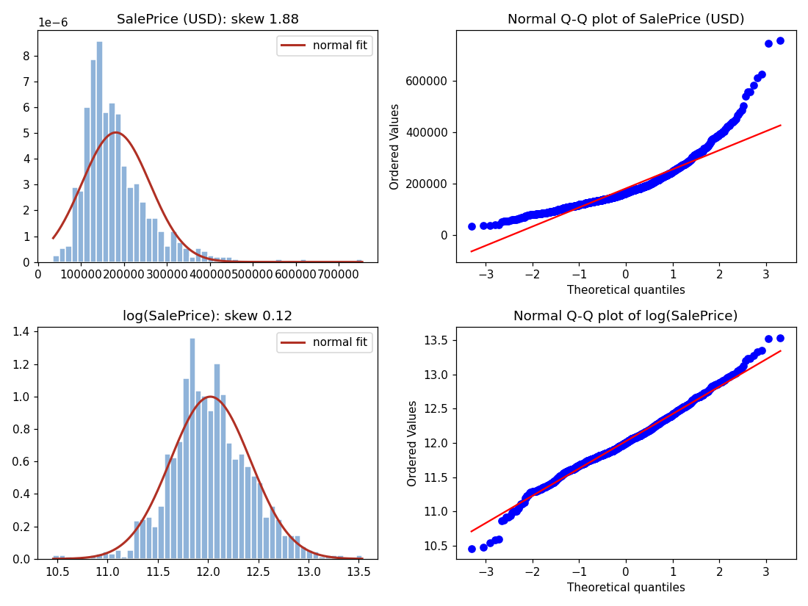

# Project 1 — What the data really looks like

Every number below is reproduced by `scripts/data_audit.py` (output in `scripts/outputs/data_audit.txt`). Checked on 28 September 2026 with pandas 3.0.1.

## 1. Shape and variable types

- `Housing.csv`: **1460 rows × 81 columns** = `Id` + 79 features + `SalePrice`. `Id` is unique; there are no duplicated rows.
- `data_description.txt` labels every feature: **35 numerical + 44 categorical**, exactly as the assignment says. Its variable names match the CSV columns exactly.
- **Trap — MSSubClass.** It is stored as integers (20, 60, 190, …) but it is a **category code** (dwelling type). If you select "numerical" columns by dtype you get **36**, not 35. Take the two lists from the description, and cast MSSubClass to `str`.
- **Numbers that are ratings.** OverallQual and OverallCond (1–10) are listed as *numerical* by the course, so treat them as numerical. The other quality ratings (ExterQual, KitchenQual, …: Ex/Gd/TA/Fa/Po) are *categorical*.
- pandas 3 reads text columns with the new `str` dtype (not `object`). Code that selects columns with `select_dtypes("object")` silently finds nothing. That is one more reason to use explicit lists.

## 2. The `NA` / `None` trap — the most important data issue

In this file the string `NA` has two meanings. For 14 variables the description lists `NA` as a **real level** ("No Basement", "No Garage", "No Pool", …). Elsewhere it means **missing**. MasVnrType has a real level called `None` ("no masonry veneer").

**pandas' default `read_csv` turns both `NA` and `None` into NaN.**

| Variable | Type | literal `NA` | literal `None` | NaN with pandas defaults | Meaning (description) |
| --- | --- | ---: | ---: | ---: | --- |
| LotFrontage | num | 259 | 0 | 259 | missing |
| MasVnrArea | num | 8 | 0 | 8 | missing |
| GarageYrBlt | num | 81 | 0 | 81 | missing (the house has no garage) |
| MasVnrType | cat | 8 | **864** | **872** | `None` = real level; `NA` = missing |
| Electrical | cat | 1 | 0 | 1 | missing |
| Alley | cat | 1369 | 0 | 1369 | real level (no alley access) |
| BsmtQual, BsmtCond, BsmtFinType1 | cat | 37 each | 0 | 37 | real level (no basement) |
| BsmtExposure, BsmtFinType2 | cat | 38 each | 0 | 38 | real level — **except 1 row each** (below) |
| FireplaceQu | cat | 690 | 0 | 690 | real level (no fireplace) |
| GarageType, GarageFinish, GarageQual, GarageCond | cat | 81 each | 0 | 81 | real level (no garage) |
| PoolQC | cat | 1453 | 0 | 1453 | real level (no pool) |
| Fence | cat | 1179 | 0 | 1179 | real level (no fence) |
| MiscFeature | cat | 1406 | 0 | 1406 | real level (none) |

**What goes wrong with the defaults.** The "missing" MasVnrType values would be imputed with the training mode. Among the non-NaN values that mode is `BrkFace`, so **872 houses** would get a brick veneer, 864 of which have none. Every "no basement / no garage / no pool" house would likewise get the most frequent *existing* category.

**Safe way to read the file:**

```python
pd.read_csv("Housing.csv", index_col="Id", keep_default_na=False,
            na_values={col: ["NA"] for col in NUMERICAL})   # only numerical 'NA' -> NaN
```

Then, in the categorical columns, turn `NA` into a real missing value **only** where it is not a valid level.

## 3. Is every `NA` level consistent with the house? — two exceptions

- **Basement:** 37 houses have `TotalBsmtSF == 0`. BsmtQual, BsmtCond and BsmtFinType1 are `NA` on exactly these 37. But:
  - **Id 949** has a basement and `BsmtExposure = NA`
  - **Id 333** has a basement and `BsmtFinType2 = NA`

  For these two houses "No Basement" is impossible, so the value is **genuinely missing** → training mode (`No` and `Unf`).
- **Garage:** 81 houses with GarageArea == 0 = GarageCars == 0 = the 81 `NA` in all four garage variables = the 81 NaN in GarageYrBlt. Fully consistent.
- **Fireplace, pool:** FireplaceQu `NA` ⟺ Fireplaces == 0; PoolQC `NA` ⟺ PoolArea == 0. Fully consistent.
- **Masonry:** the 8 missing MasVnrType are the same 8 houses as the missing MasVnrArea. Five houses have type `None` but an area > 0, and 2 have a real type but area 0. These are small data errors; leave them as they are.
- **Electrical:** 1 missing value (`NA` is not a listed level) → training mode `SBrkr`.

**GarageYrBlt is special.** It is numerical, and its 81 NaN mean "no garage", not "unknown". The assignment says numerical NaN → training mean (1978.7 on our split). That puts a made-up year on those houses. It does little harm, because the "no garage" effect is carried by the `GarageType_NA` (etc.) dummy anyway. It is worth one sentence in the notebook.

## 4. What is really missing after this recoding

| Variable | Missing | Type | Imputed with (training set, seed 42) |
| --- | ---: | --- | --- |
| LotFrontage | 259 | numerical | mean 70.4 |
| GarageYrBlt | 81 | numerical | mean 1978.7 |
| MasVnrArea | 8 | numerical | mean 105.3 |
| MasVnrType | 8 | categorical | mode `None` |
| BsmtExposure | 1 (Id 949) | categorical | mode `No` |
| BsmtFinType2 | 1 (Id 333) | categorical | mode `Unf` |
| Electrical | 1 | categorical | mode `SBrkr` |

In total 359 of 115,340 cells (0.31%).

## 5. Categorical levels

- 281 levels in total (including the `NA` levels) → **281 one-hot columns** on the full data. After the 70/30 split the training set has fewer (see section 9).
- Most levels: Neighborhood 25, Exterior2nd 16, Exterior1st 15, MSSubClass 15.
- **35 levels occur at most twice** in all 1460 houses, e.g. RoofMatl `Metal`/`Membran`/`Roll`/`ClyTile` (1 each), Utilities `NoSeWa` (1), Condition2 `PosA`/`RRAn`/`RRAe` (1 each), PoolQC `Ex`/`Fa` (2 each), Heating `Floor` (1), Electrical `Mix` (1).

**Consequences.**

- some levels appear only in the test set, or only in some CV folds → the encoder needs `handle_unknown="ignore"`, and `reindex(..., fill_value=0)` for `pd.get_dummies`
- OLS gives such levels extreme coefficients, fitted to 1–3 houses. This is what regularization fixes

**Spelling differences between the file and the description.** Examples: `C (all)` vs `C`, `NAmes` vs `Names`, `2fmCon`/`Duplex`/`Twnhs` vs `2FmCon`/`Duplx`/`TwnhsI`, `Brk Cmn`/`CmentBd`/`Wd Shng`. They are harmless, because one-hot only needs consistent labels inside the file.

## 6. Exact linear identities — why Question 2.b is built the way it is

These two identities hold on **every row**:

$$\texttt{TotalBsmtSF}=\texttt{BsmtFinSF1}+\texttt{BsmtFinSF2}+\texttt{BsmtUnfSF}
\qquad
\texttt{GrLivArea}=\texttt{1stFlrSF}+\texttt{2ndFlrSF}+\texttt{LowQualFinSF}$$

None of these 8 columns has missing values, so the identities survive mean imputation. They also survive standardization, since it is an affine map and the means satisfy the same identity. Therefore the numerical design matrix A (intercept + 35 columns) has **rank 34, not 36**. Its columns are linearly dependent: Case 2 of Notes 2.1. See `4_Plan_and_Decisions.md`, step 2.b.

**Strong but not exact correlations** (|r| ≥ 0.75): GarageCars–GarageArea 0.88, YearBuilt–GarageYrBlt 0.83, GrLivArea–TotRmsAbvGrd 0.83, TotalBsmtSF–1stFlrSF 0.82. They inflate standard errors, but they do not break the rank.

## 7. The target SalePrice

| | mean | median | sd | skewness | excess kurtosis | Jarque-Bera p |
| --- | ---: | ---: | ---: | ---: | ---: | ---: |
| SalePrice (USD) | 180,921 | 163,000 | 79,443 | **1.88** | 6.51 | ≈ 0 |
| log(SalePrice) | 12.02 | 12.00 | 0.40 | **0.12** | 0.80 | 5e-10 |



- **Raw:** strongly right-skewed. The Q-Q plot bends upwards (a long right tail), and the mean is above the median. Not Gaussian.
- **Log:** almost symmetric, and the Q-Q plot is close to the straight line. There is a slightly heavy lower tail (a few very cheap houses). A formal test still rejects exact normality: with 1460 points even small deviations are "significant". The assignment asks for a **graphical** judgement, and graphically the log is **approximately Gaussian**.
- **Box-Cox** maximum-likelihood λ = −0.077 (full data) and −0.063 (training data only). λ = 0 is exactly the log, so the plain log is the natural choice. It also has **no parameter to estimate**, so it cannot leak information from the test set.
- Prices are all positive (min $34,900, max $755,000), so `np.log` is safe. `log1p` is not needed.
- Skewed features exist too (MiscVal 24.5, PoolArea 14.8, LotArea 12.2, …). Transforming them is not asked, but it is a possible improvement for *Limitations*.

## 8. Unusual houses

| Id | GrLivArea | OverallQual | Neighborhood | SaleCondition | SalePrice |
| ---: | ---: | ---: | --- | --- | ---: |
| 524 | 4676 | 10 | Edwards | **Partial** | 184,750 |
| 1299 | 5642 | 10 | Edwards | **Partial** | 160,000 |
| 692 | 4316 | 10 | NoRidge | Normal | 755,000 (most expensive) |
| 1183 | 4476 | 10 | NoRidge | Abnorml | 745,000 |

Ids 524 and 1299 are the largest, best-quality houses in the file, but they sold cheaply as "Partial" sales. The author of the Ames data (De Cock, 2011) recommends removing houses over 4000 sq ft for teaching. The assignment does not ask for any removal, so **keep them** in the main analysis and **discuss** their effect (sections 9 and `4_Plan_and_Decisions.md`).

## 9. The 70/30 split with `random_state = 42`

- 1022 training and 438 test houses. Mean log price: 12.029 (train) vs 12.013 (test).
- **Ids 524, 1299 and 1183 are in the training set; Id 692 is in the test set.** The two cheap giants pull the fit and give large in-sample USD errors. This explains an unusual result in 2.a: the in-sample USD MSE is **larger** than the out-of-sample one.
- After the 1.d preparation: **train 1022 × 311, test 438 × 311** (35 numerical + 276 one-hot columns).
- **Five test levels never occur in training.** Their dummy columns are dropped by the `reindex`, so these houses get an all-zero block for that variable:

| Level | Test Ids |
| --- | --- |
| Condition2_PosA | 584 |
| Condition2_RRNn | 30, 549 |
| Electrical_Mix | 399 |
| Exterior1st_ImStucc | 1188 |
| RoofMatl_Membran | 272 |

The seed is fixed once, before looking at results. Never change it to get nicer numbers. The robustness check (repeat the split with several seeds) answers "does it depend on the split?".
